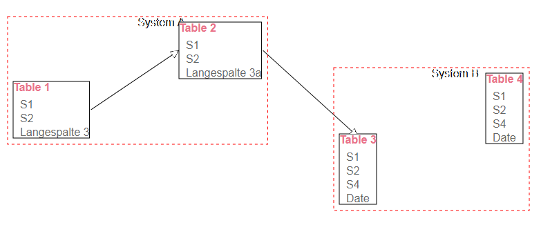

# SVG::DBTable

Display (DBI) catalog information as SVG

This is intended as a configurable (but manual) layout tool for large database
schemas. The information about table references and systems will likely not
come from the database/DBI catalog functions but from a separate table, as
not all tables are relevant and not all links between tables can be mirrored
in the schema as `REFERENCES` clauses.

This demo mainly consists of the SVG part and a rudimentary backend which
supplies the data but does not yet save the layout.
